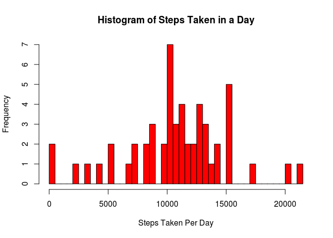
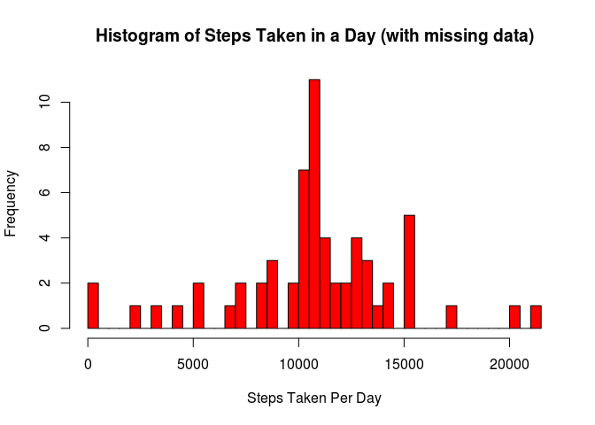

# Reproducible Research: Peer Assessment 1
## Loading and preprocessing the data

The activity data was unzipped and loaded into R using the following code:


```r
unzip("activity.zip")  
raw_data <- read.csv("activity.csv",
                 header = TRUE)
```

## What is mean total number of steps taken per day?

The data was sorted into a table of total steps per day using the following code:

```r
stepsPerDay<- aggregate(raw_data$steps, by=list(raw_data$date), FUN = sum)
colnames(stepsPerDay)<-c("date","steps")
```
And then a histogram was constructed of total steps per day:

```r
hist(stepsPerDay$steps, 
     main = "Histogram of Steps Taken in a Day",
     breaks = length(stepsPerDay$date), 
     xlab = "Steps Taken Per Day",
     col = "red")
```

 

Mean and Median were calculated:

```r
mean_steps = mean(stepsPerDay$steps, na.rm = TRUE)
median_steps = median(stepsPerDay$steps, na.rm = TRUE)
```
There was a mean of 1.0766 &times; 10<sup>4</sup> and a median of 10765 taken per day (disregarding missing data)

## What is the average daily activity pattern?
A plot of average number of steps in each time interval was made.

```r
aveSteps<-aggregate(raw_data$steps, by=list(raw_data$interval), FUN = mean, na.rm = TRUE)
colnames(aveSteps)<-c("interval", "steps")
plot(aveSteps$interval, 
     aveSteps$steps, 
     type = 'l',
     main = "Average Steps Throughout the Day",
     xlab = "Time Interval (beginning minute)",
     ylab = "Average Steps")
```

 

```r
ordered_aveSteps<- aveSteps[with(aveSteps, order(-aveSteps$steps)), ]
max_steps = ordered_aveSteps$steps[1]
max_interval = ordered_aveSteps$interval[1]
```
The maximum average number of steps in a five minute period is 206.1698 in the interval beginning at minute 835.

## Imputing missing values


```r
missing<-is.na(raw_data$steps)
n.missing<-sum(missing)
```
There was a total of 2304 missing data points.

To fill in the missing data points, the average for that interval across all present data was used:

```r
filled_data<-raw_data
for (i in 1:length(filled_data$steps)){
    if(is.na(filled_data$steps[i])){
        if(i%%length(aveSteps$steps)==0){
            filled_data$steps[i]<-aveSteps$steps[length(aveSteps$steps)]
        }
        else{filled_data$steps[i]<-aveSteps$steps[i%%length(aveSteps$steps)]
        }
    }
}
stepsPerDay_filled<- aggregate(filled_data$steps, by=list(filled_data$date), FUN = sum)
colnames(stepsPerDay_filled)<-c("date","steps")
```

And then a histogram was constructed of total steps per day (with missing data filled in):

```r
hist(stepsPerDay_filled$steps, 
     main = "Histogram of Steps Taken in a Day (with missing data)",
     breaks = length(stepsPerDay_filled$date), 
     xlab = "Steps Taken Per Day",
     col = "red")
```

 

Mean and Median were calculated:

```r
mean_steps_filled = mean(stepsPerDay_filled$steps)
median_steps_filled = median(stepsPerDay_filled$steps)
```
There was a mean of 1.0766 &times; 10<sup>4</sup> and a median of 1.0766 &times; 10<sup>4</sup> taken per day (including filling in missing data).
Approximating the missing data with this method results in no change to the mean and a very small increase in the median.

## Are there differences in activity patterns between weekdays and weekends?

Using the data which includes the filled-in missing values, a new variable was added to the data set to indicate if the day is a weekend or weekday.

```r
dates<- strptime(filled_data$date, format = "%Y-%m-%d")
days<-weekdays(dates)
for (i in 1:length(days)){
    if (days[i] == "Saturday"){
        filled_data$Day[i] <- "weekend"
    }
    else if (days[i] ==  "Sunday"){
        filled_data$Day[i] <- "weekend"
    }
    else{
        filled_data$Day[i] <- "weekday"
    }
}
```

A panel plot was then constructed of the average steps taken per five minute interval for weekends and weekdays.


```r
library(lattice)
filled_data_weekend<-subset(filled_data, filled_data$Day == "weekend")
aveSteps_weekend<-aggregate(filled_data_weekend$steps, 
                           by=list(filled_data_weekend$interval), 
                           FUN = mean)
colnames(aveSteps_weekend)<-c("interval", "steps")
aveSteps_weekend$Day<-"weekend"

filled_data_weekday<-subset(filled_data, filled_data$Day == "weekday")
aveSteps_weekday<-aggregate(filled_data_weekday$steps, 
                           by=list(filled_data_weekday$interval), 
                           FUN = mean)
colnames(aveSteps_weekday)<-c("interval", "steps")
aveSteps_weekday$Day<-"weekday"

xyplot(steps ~ interval | Day, 
       data = merge(aveSteps_weekday, aveSteps_weekend, all = TRUE), 
       layout = c(1,2),
       xlab = "Interval",
       ylab = "Number of Steps",
       type = 'l')
```

 
